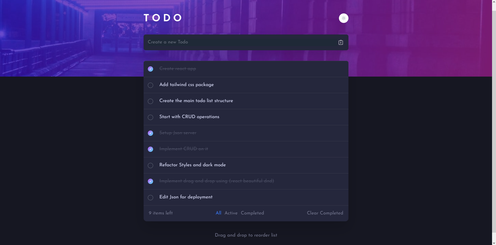

# Frontend Mentor - Todo app solution

This is a solution to
the [Todo app challenge on Frontend Mentor](https://www.frontendmentor.io/challenges/todo-app-Su1_KokOW). Frontend
Mentor challenges help you improve your coding skills by building realistic projects.

## Table of contents

- [Overview](#overview)
    - [The challenge](#the-challenge)
    - [Screenshot](#screenshot)
    - [Links](#links)
- [My process](#my-process)
    - [Built with](#built-with)
    - [What I learned](#what-i-learned)
    - [Continued development](#continued-development)
    - [Useful resources](#useful-resources)
- [Author](#author)
- [Acknowledgments](#acknowledgments)


## Overview

### The challenge

Users should be able to:

- View the optimal layout for the app depending on their device's screen size
- See hover states for all interactive elements on the page
- Add new todos to the list
- Mark todos as complete
- Delete todos from the list
- Filter by all/active/complete todos
- Clear all completed todos
- Toggle light and dark mode
- **Bonus**: Drag and drop to reorder items on the list

### Screenshot




### Links

- Solution URL: [Github Repo](https://github.com/AbdElrahmanGbr/todo-list-reactjs)
- Live Site URL: [Deployed on Railway](https://web-production-a84d.up.railway.app/)
- Live Site URL: [Deployed on Heroku](https://todo-list-gbr.herokuapp.com)

## My process

### Built with

- Semantic HTML5 markup
- CSS custom properties
- Flexbox
- CSS Grid
- Mobile-first workflow
- [React](https://reactjs.org/) - JS library
- [Tailwind CSS](https://tailwindcss.com) - For styles
- Used JSON server package during development to allow full CRUD
- Did some edits with the api and server js file for deployment (from json server to Nodejs)

### What I learned

I have learned to implement drag and drop using (react beautiful dnd package):

```js
const defaultList = ["A", "B", "C", "D", "E"];

// React state to track order of items
const [itemList, setItemList] = useState(defaultList);
```

```js
// Function to update list on drop
const handleDrop = (droppedItem) => {
    // Ignore drop outside droppable container
    if (!droppedItem.destination) return;
    var updatedList = [...itemList];
    // Remove dragged item
    const [reorderedItem] = updatedList.splice(droppedItem.source.index, 1);
    // Add dropped item
    updatedList.splice(droppedItem.destination.index, 0, reorderedItem);
    // Update State
    setItemList(updatedList);
};
```

```js
<div className="App">
  <DragDropContext onDragEnd={handleDrop}>
    <Droppable droppableId="list-container">
    </Droppable>
  </DragDropContext>
</div>
```

### Continued development

- Next I will add authentication for users and each user will have his own todo list after updating the backend .

### Useful resources

- [Simple Drag and Drop List in React JS](https://contactmentor.com/react-drag-drop-list/) - This helped me to implement the drag and drop section. I really liked this pattern and will
  use it going forward.
- [VSCode Extension (Color Highlight)](https://marketplace.visualstudio.com/items?itemName=naumovs.color-highlight) - This is an amazing tool which helped me to check for colors in the style-guide.md file before using them.
- [How to Deploy reactjs with JSON server](https://dev.to/yongchanghe/deploy-react-app-with-json-server-on-heroku-59ak) - This is a very useful article that helped me with editing my json server code with some nodejs to deploy it within the react project. I'd recommend it to anyone still learning this concept.

## Author

- AbdElrahman Gbr
- Frontend Mentor - [@AbdElrahmanGbr](https://www.frontendmentor.io/profile/AbdElrahmanGbr)

## Acknowledgments

Thanks to The Net Ninja and Dave Gray tutorials they helped me understand  the basics of the project.

